# Báo cáo phương pháp xây dựng phần mềm và biểu đồ thiết kế - HustFood

Tài liệu này tổng hợp nội dung phục vụ báo cáo môn Nhập môn Công nghệ Phần mềm cho hệ thống HustFood. Các biểu đồ được viết bằng Mermaid để có thể render trực tiếp trên GitHub, VS Code hoặc Mermaid Live Editor.

## 1. Tổng quan dự án

HustFood là ứng dụng đặt và giao đồ ăn trực tuyến được xây dựng bằng Next.js App Router, React, Prisma và MySQL. Hệ thống mô phỏng các luồng nghiệp vụ chính:

- Khách hàng tìm cửa hàng, đặt món, thanh toán, theo dõi đơn và đánh giá.
- Người bán quản lý hồ sơ cửa hàng, thực đơn, đơn hàng, doanh thu và đề xuất món.
- Người giao hàng nhận đơn, cập nhật trạng thái giao hàng và vị trí.
- Quản trị viên quản lý người dùng, cửa hàng, thực đơn, đơn hàng, hoàn tiền và duyệt nội dung.

## 2. Phương pháp xây dựng phần mềm đã sử dụng

### 2.1 Lựa chọn phương pháp

Phương pháp phù hợp với dự án là **Agile theo mô hình Scrum/Kanban nhẹ**.

Lý do không chọn Waterfall thuần túy:

- Yêu cầu thay đổi liên tục trong quá trình phát triển: đăng ký tài khoản, OAuth, JWT, quản lý store, shipper, rating, deploy Vercel, Prisma/Aiven.
- Cần có bản chạy được sớm để kiểm thử trực tiếp trên giao diện và cơ sở dữ liệu thật.
- Các chức năng có thể chia thành các increment độc lập: Auth, Cart, Order, Seller, Shipper, Admin, Review, Payment, Security.
- Mỗi lần hoàn thành một phần đều build, test, push và deploy để phát hiện lỗi sớm.

### 2.2 Cách áp dụng Agile trong dự án

Dự án được triển khai theo các vòng lặp ngắn. Mỗi vòng lặp gồm:

1. Phân tích yêu cầu nhỏ từ SRS/TODO.
2. Tạo branch riêng cho nhóm chức năng lớn.
3. Thiết kế nhanh luồng dữ liệu, API và giao diện.
4. Cài đặt chức năng.
5. Kiểm thử bằng lint, unit test, build production và test thủ công.
6. Commit, push, merge vào `main`.
7. Deploy lên Vercel và sửa lỗi runtime nếu có.

### 2.3 So sánh với các mô hình khác

| Tiêu chí | Waterfall | Agile Scrum/Kanban | Lựa chọn cho HustFood |
| --- | --- | --- | --- |
| Thay đổi yêu cầu | Khó xử lý | Xử lý tốt | Agile |
| Cần bản demo sớm | Không tối ưu | Rất phù hợp | Agile |
| Dự án sinh viên, deadline ngắn | Rủi ro nếu làm tuyến tính | Chia nhỏ để giao hàng nhanh | Agile |
| Kiểm thử liên tục | Thường ở cuối dự án | Sau mỗi increment | Agile |
| Deploy thật lên Vercel | Không phải trọng tâm | Phù hợp CI/CD nhẹ | Agile |

### 2.4 Method Diagram - Quy trình Agile đã áp dụng

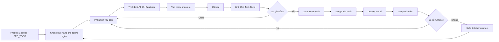

## 3. Tác nhân và Use Case

### 3.1 Danh sách tác nhân

| Tác nhân | Vai trò |
| --- | --- |
| Guest | Xem thực đơn, xem cửa hàng, đăng nhập, đăng ký |
| Customer | Đặt món, thanh toán, theo dõi đơn, đánh giá |
| Seller | Quản lý cửa hàng, thực đơn, đơn hàng, doanh thu |
| Shipper | Nhận đơn, cập nhật giao hàng, báo sự cố |
| Admin | Quản trị tài khoản, cửa hàng, thực đơn, đơn hàng, hoàn tiền |
| Google OAuth | Nhà cung cấp đăng nhập bên ngoài |
| Payment Provider | Mô phỏng thanh toán Momo/Card/COD |
| Database | Lưu trữ dữ liệu hệ thống |

### 3.2 Use-Case Diagram tổng quát

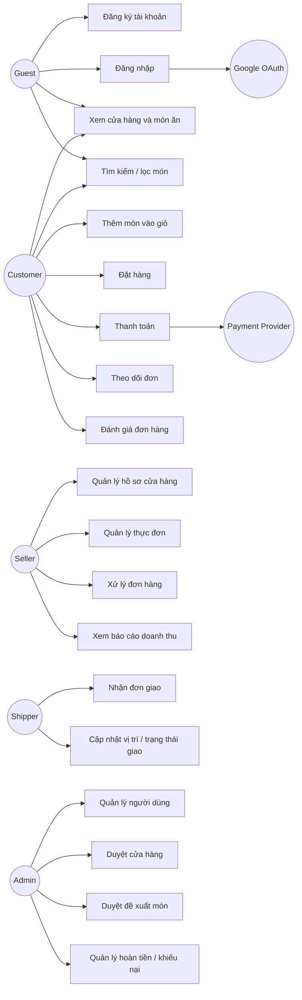

### 3.3 Use Case chi tiết - Đặt hàng

| Mục | Nội dung |
| --- | --- |
| Tên use case | Đặt món ăn |
| Tác nhân chính | Customer |
| Tiền điều kiện | Customer đã đăng nhập, giỏ hàng có ít nhất một món |
| Hậu điều kiện | Đơn hàng được tạo, seller có thể xử lý |
| Luồng chính | Chọn món -> giỏ hàng -> nhập thông tin giao hàng -> chọn thanh toán -> tạo đơn |
| Luồng ngoại lệ | Món hết hàng, thanh toán online thất bại, voucher không hợp lệ |

## 4. Activity Diagram

### 4.1 Activity Diagram - Luồng đặt món của khách hàng

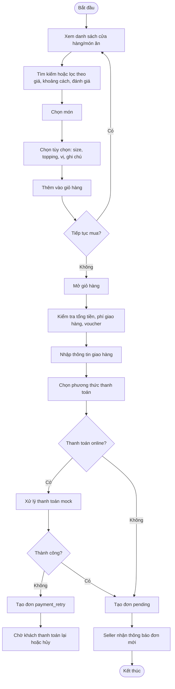

### 4.2 Activity Diagram - Xử lý đơn hàng

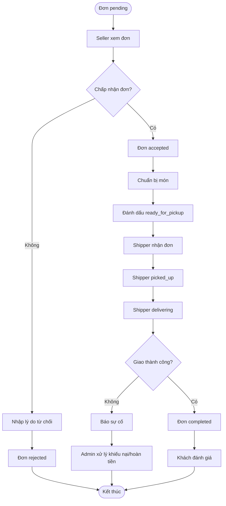

## 5. Sequence Diagram

### 5.1 Sequence Diagram - Đăng nhập và JWT session

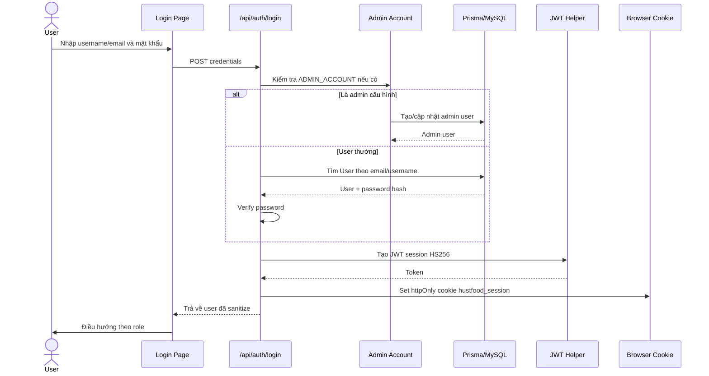

### 5.2 Sequence Diagram - Đặt hàng

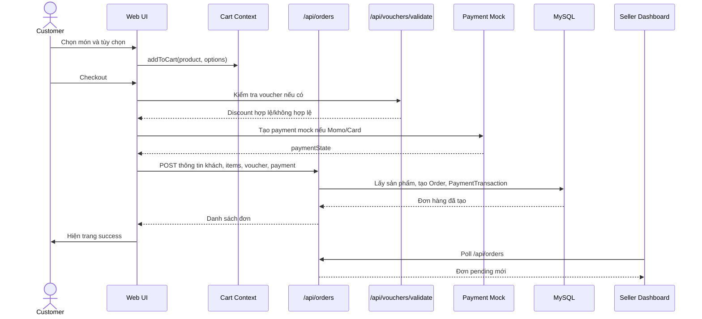

### 5.3 Sequence Diagram - Seller cập nhật hồ sơ cửa hàng

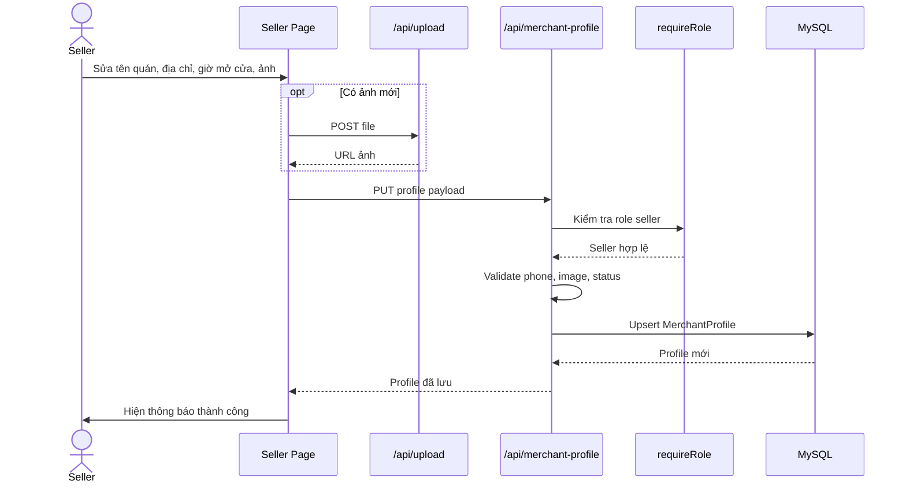

## 6. State Diagram

### 6.1 State Diagram - Trạng thái đơn hàng

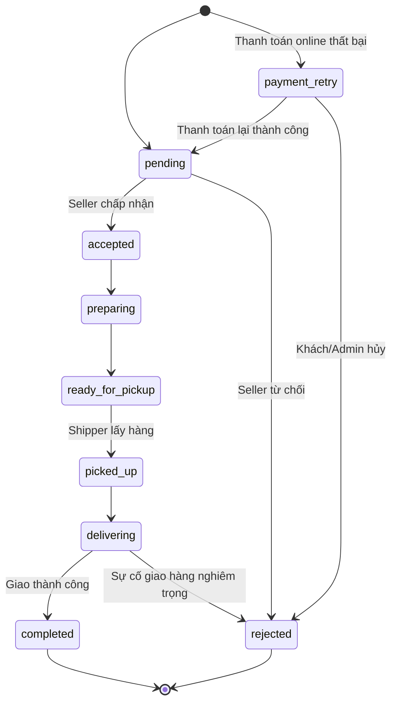

### 6.2 State Diagram - Trạng thái cửa hàng

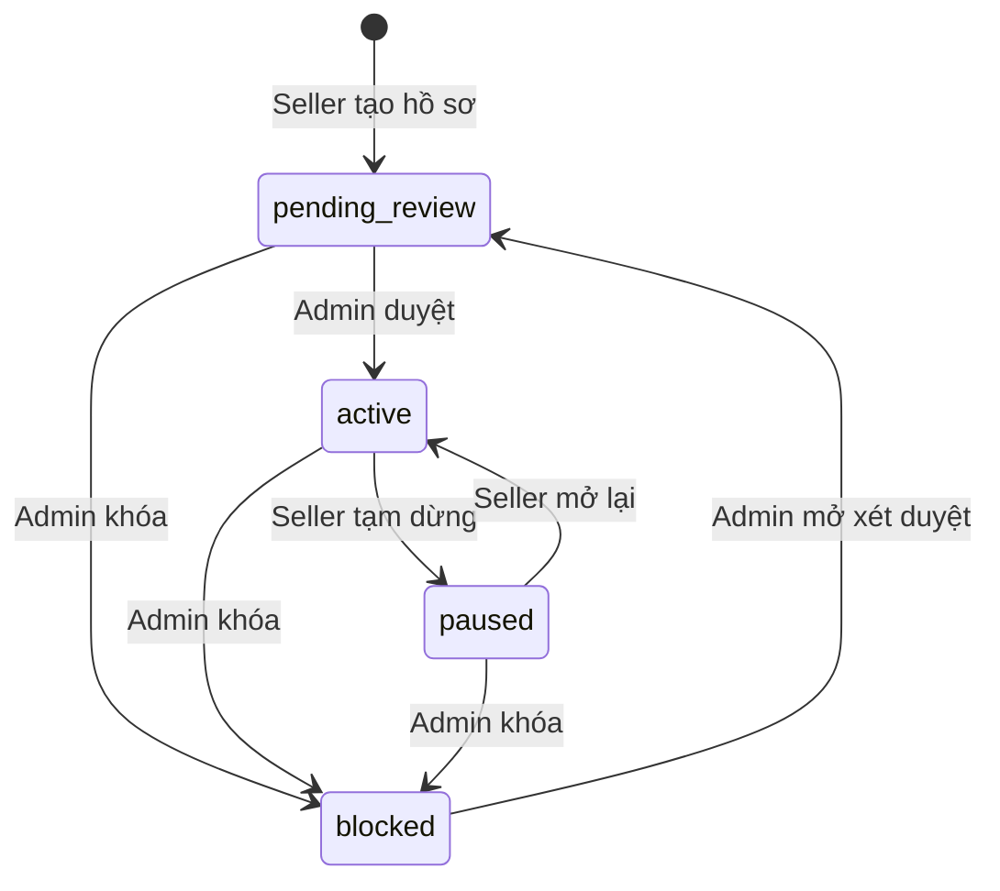

## 7. Class / Domain Model Diagram

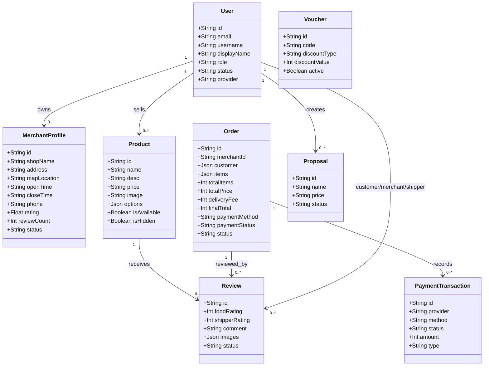

## 8. ERD - Database Diagram

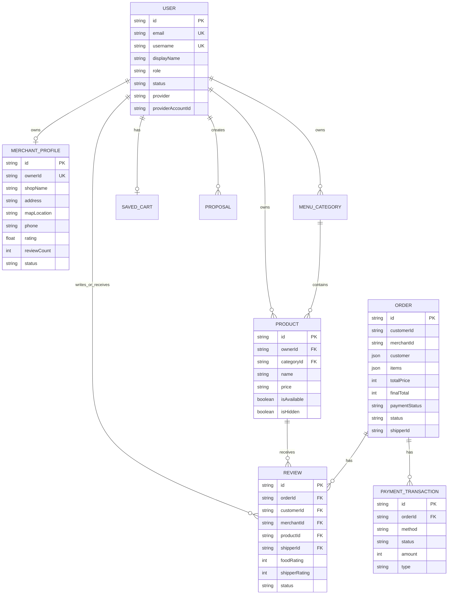

## 9. Component Diagram

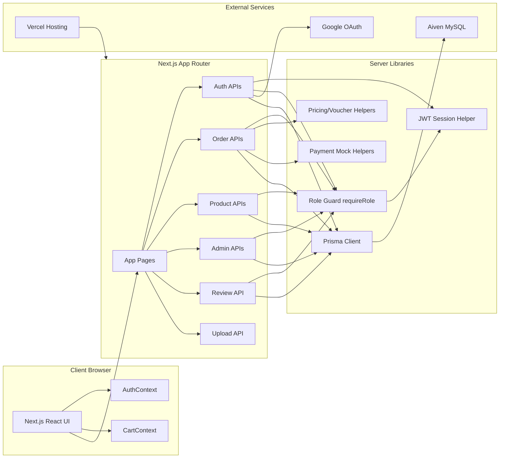

## 10. Deployment Diagram

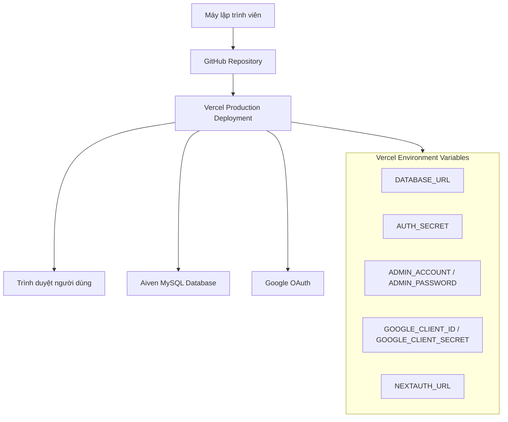

## 11. Data Flow Diagram mức 0

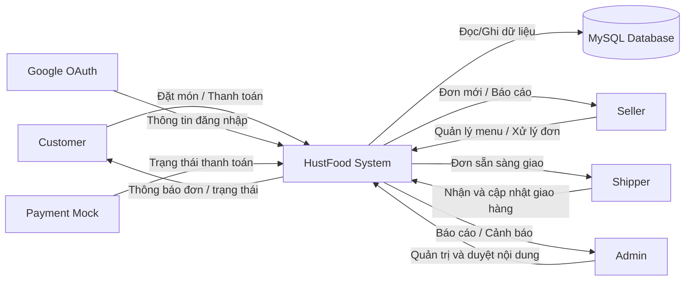

## 12. Kiến trúc bảo mật

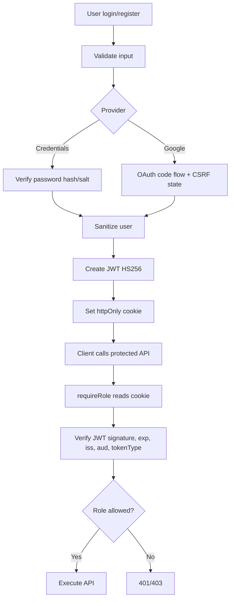

## 13. Bảng yêu cầu chức năng chính

| Mã | Chức năng | Tác nhân | Mức độ |
| --- | --- | --- | --- |
| FR-01 | Đăng ký/đăng nhập bằng credentials và Google OAuth | Guest | Cao |
| FR-02 | Phân quyền customer/seller/shipper/admin | Tất cả | Cao |
| FR-03 | Xem, tìm kiếm, lọc cửa hàng và món ăn | Guest, Customer | Cao |
| FR-04 | Quản lý giỏ hàng và voucher | Customer | Cao |
| FR-05 | Tạo đơn và thanh toán COD/Momo/Card mock | Customer | Cao |
| FR-06 | Seller xử lý đơn và xem báo cáo | Seller | Cao |
| FR-07 | Shipper nhận đơn, cập nhật vị trí/trạng thái | Shipper | Cao |
| FR-08 | Admin quản lý người dùng/cửa hàng/menu/đơn | Admin | Cao |
| FR-09 | Đánh giá đơn hàng và tính rating cửa hàng | Customer | Trung bình |
| FR-10 | Backup, deploy, cấu hình database | Admin/Dev | Trung bình |

## 14. Bảng yêu cầu phi chức năng

| Nhóm | Yêu cầu |
| --- | --- |
| Bảo mật | JWT ký bằng `AUTH_SECRET`, cookie httpOnly, role guard cho API |
| Khả dụng | Deploy trên Vercel, database managed MySQL |
| Bảo trì | Tách helper: pricing, auth, reviews, statuses, financialDashboard |
| Kiểm thử | Có lint, unit test helper và build production trước khi merge |
| Hiệu năng | Dùng Next.js App Router, Prisma query có include/select theo nhu cầu |
| Tin cậy | API trả lỗi rõ ràng, UI tránh crash khi response không đúng dạng |

## 15. Kế hoạch kiểm thử

| Nhóm test | Nội dung |
| --- | --- |
| Unit test | Pricing, payment checksum, JWT verify, review moderation, status helpers |
| Integration manual | Đăng nhập, đăng ký, Google OAuth, tạo đơn, seller xử lý đơn, shipper giao hàng |
| UI manual | Home, cart, checkout, seller dashboard, shipper dashboard, admin dashboard |
| Database test | `npx prisma validate`, `npx prisma db push`, seed data |
| Production test | Build Vercel, kiểm tra env, test các route chính sau deploy |

## 16. Kết luận

Dự án HustFood phù hợp với Agile vì quá trình phát triển cần lặp nhanh, kiểm thử liên tục và sửa lỗi sau deploy. Bộ biểu đồ trên mô tả các khía cạnh chính của một hệ thống phần mềm: tác nhân, use case, activity, sequence, state, domain model, ERD, component, deployment và data flow.

Nội dung này có thể dùng làm khung cho bài báo cáo Nhập môn Công nghệ Phần mềm, sau đó bổ sung ảnh chụp giao diện, phân công thành viên, timeline và kết quả kiểm thử thực tế.
